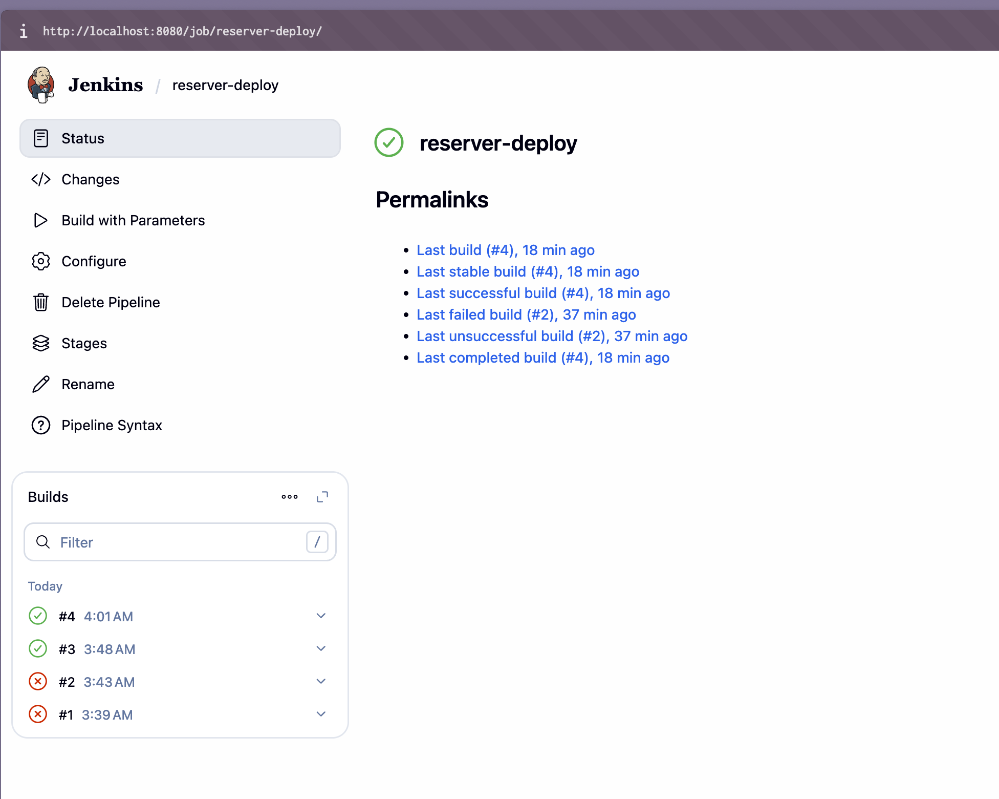
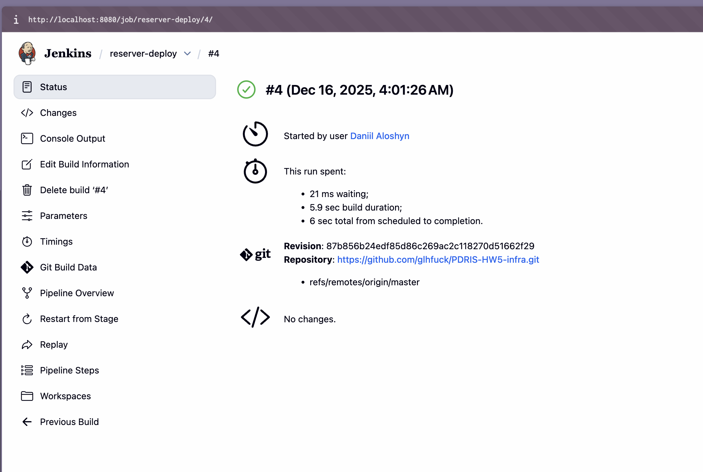
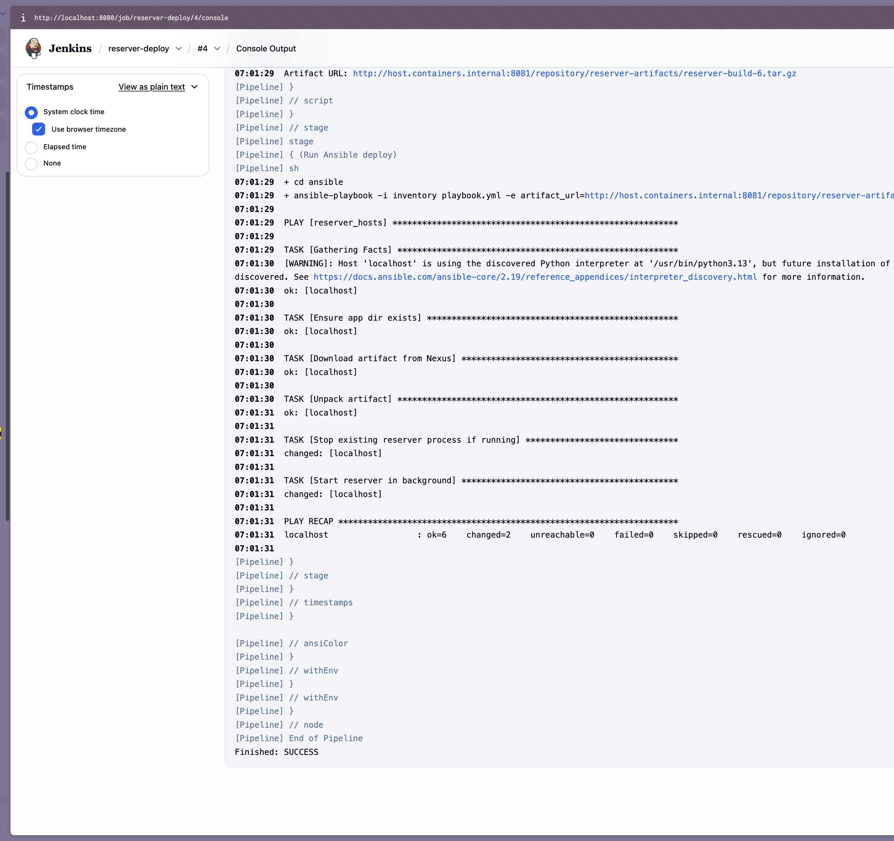
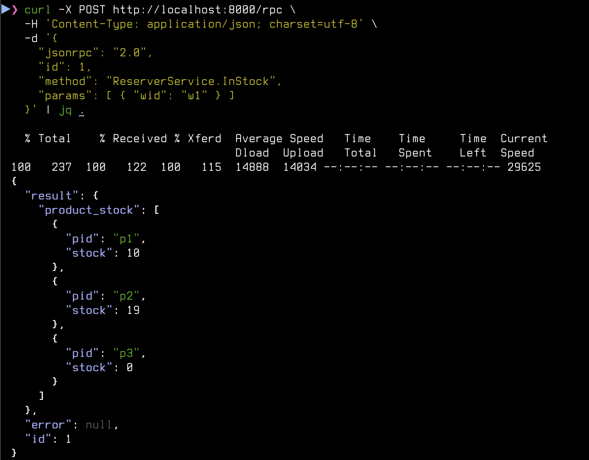

## ДЗ-5 Jenkins-infra (CD, Jenkins + Ansible + Nexus)


# CD для Reserver Service (Jenkins + Ansible + Nexus)

Этот репозиторий содержит код деплоя сервиса:

- Ansible (`ansible/inventory`, `ansible/playbook.yml`)
- Jenkins deploy pipeline (`Jenkinsfile.deploy`)

Сервис разворачивается **из артефакта в Nexus**, без участия исходников.

## Ansible

- `ansible/inventory`:

  ```ini
  [reserver_hosts]
  localhost ansible_connection=local
  ```

- `ansible/playbook.yml`:

  1. Создаёт каталог `/var/jenkins_home/reserver`
  2. Скачивает артефакт из Nexus (`artifact_url`, передаётся из Jenkins)
  3. Распаковывает архив (бинарник + config)
  4. Останавливает старый процесс (`pkill reserver || true`)
  5. Запускает новый процесс `reserver` в фоне (`nohup ... &`)

## Jenkins deploy pipeline

Файл: `Jenkinsfile.deploy`.

### Параметр

- `BUILD_TAG` — тег билда из CI, например `build-6`  
  (соответствует артефакту `reserver-build-6.tar.gz` в Nexus).

### Логика пайплайна

1. **Checkout infra repo**  
   Забирает этот репозиторий (Ansible + Jenkinsfile.deploy).

2. **Prepare Artifact URL**  
   Формирует URL артефакта:

   ```text
   http://host.containers.internal:8081/repository/reserver-artifacts/reserver-build-<BUILD_TAG>.tar.gz
   ```

3. **Run Ansible deploy**  

   ```bash
   cd ansible
   ansible-playbook -i inventory playbook.yml \
     -e "artifact_url=${ARTIFACT_URL}"
   ```

   → скачивает архив из Nexus и перезапускает сервис.

## Скриншоты

- 
- 
- 
- 